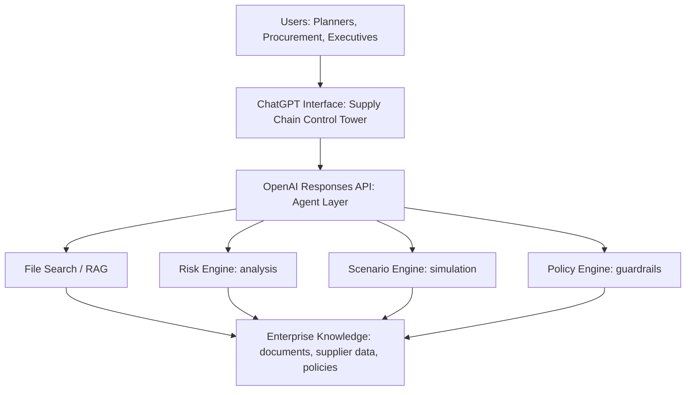

# Supply Chain Copilot Demo

Supply chain copilot to support inventory, cost, delivery, and risk decisions.

This repository supports an executive-level OpenAI presentation:

**From Fragmented Supply Chains to AI-Driven Decision Intelligence**

The demo is intentionally lightweight, deterministic, and presentation-safe. It shows how ChatGPT and the OpenAI API can become a secure supply-chain control tower across fragmented planning, procurement, supplier, and policy data.

## Executive Story

Manufacturing supply chains are not short on data. They are short on decision intelligence.

Typical pain points:

- Planners, buyers, and executives work from different systems and different summaries.
- Risk signals arrive as emails, spreadsheets, supplier portals, ERP data, logistics updates, and policy documents.
- Scenario planning is slow, manual, and hard to explain.
- Executives need recommended action, not another dashboard.

OpenAI's role in the story:

- **ChatGPT** is the natural-language interface for planners, procurement, and executives.
- **Responses API** is the agent layer that reasons over context and calls tools.
- **File Search / RAG** grounds answers in enterprise knowledge.
- **Risk, scenario, and policy engines** add deterministic business logic.
- **Guardrails and human review** keep sensitive decisions controlled.

## Architecture Flow



## Demo Workflows

1. **Weekly risk scan**: "What are the current top supply chain risks across all suppliers this week?"
2. **Delay scenario**: "What happens if Supplier A is delayed by 2 weeks?"
3. **Supplier consolidation**: "Which suppliers should we consolidate, and what is the risk impact?"

Each workflow demonstrates the same decision loop:

1. Ask a business question.
2. Route through the OpenAI agent layer.
3. Retrieve trusted supply-chain context.
4. Run analysis or simulation.
5. Apply policy constraints.
6. Return an explainable recommendation with evidence.

## Run Locally

```bash
python3 -m http.server 8000
```

Then open:

```text
http://localhost:8000
```

## GitHub Push

If the remote already contains a README or initial commit:

```bash
git pull --rebase origin main
git add .
git rebase --continue
git push -u origin main
```

If the remote only has disposable starter files and you want this local version to win:

```bash
git push -u origin main --force-with-lease
```

## Production Upgrade Path

For a customer pilot, replace the static demo data with:

- ERP and planning data for orders, parts, inventory, and demand.
- Supplier scorecards, contracts, and policy documents.
- Logistics, quality, weather, geopolitical, and financial risk signals.
- A backend `/api/copilot` endpoint using the OpenAI Responses API.
- Tool calls for risk scoring, scenario simulation, policy checks, and audit logging.

Start with a narrow pilot: one product family, one supplier category, three decision workflows, and a clear measurement baseline.
